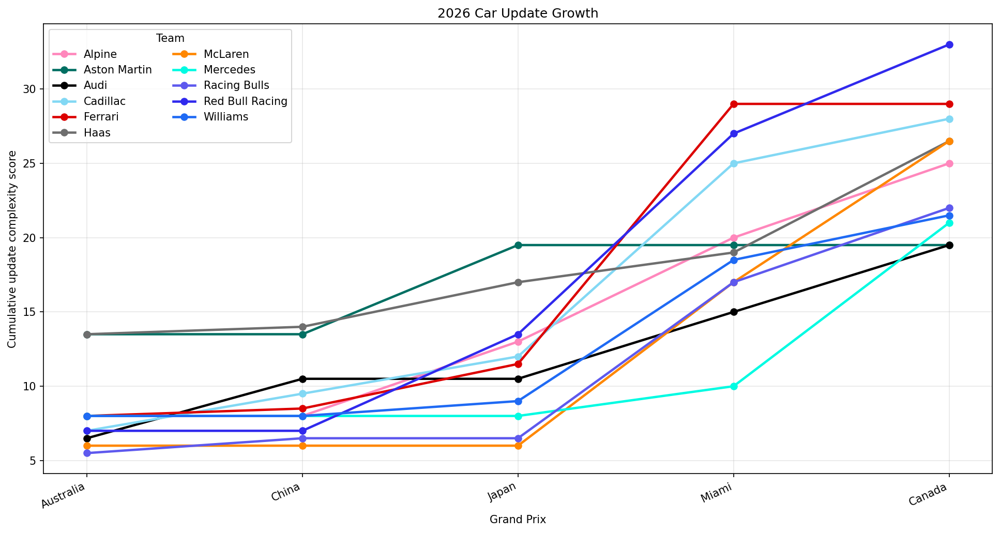

# woUpgrade

Formula 1 car update tracking from FIA car presentation submissions.

`woUpgrade` converts manually extracted FIA car presentation rows into a
component-complexity score, then plots each team's cumulative update growth
across grands prix. It is deliberately small and mirrors the `woStrategy`
plot/script workflow: editable JSON data, a plotting layer, and a script layer.

## What Is Included

```text
src/woupgrade/data/rubric.json        # component -> complexity score and aliases
src/woupgrade/data/updates_2026.json  # manual update items from PDF submissions
src/woupgrade/plots/update_growth.py  # matplotlib trend plot
src/woupgrade/script/update_growth.py # CLI/workflow orchestration
doc/AI_AGENT_CONTEXT.md               # handoff notes for future AI agents
doc/DATA_CONTRACT.md                  # JSON schema and scoring rules
doc/PACKAGE_MAP.md                    # file/layer responsibilities
doc/assets/example_update_growth_2026.png
                                      # committed example plot
ref/                                  # local raw PDFs, ignored by git
temp/                                 # generated plots/CSVs, ignored by git
```

Raw PDFs are not the committed source of truth. They are local reference files
for manual audit only. The committed source of truth is the JSON in
`src/woupgrade/data/`.

## Install

From `woUpgrade/`:

```bash
python -m pip install -e .
```

The package depends on `matplotlib` and `pandas`. When working in this workspace,
the existing `woStrategy` virtualenv can also run the script directly.

## Run

Editable-install/module style:

```bash
cd /Users/zhxutong/dr-wo/woUpgrade
python -m woupgrade.script.update_growth \
  --year 2026 \
  --output temp/update_growth_2026.png \
  --summary-output temp/update_growth_2026.csv
```

Direct script style:

```bash
cd /Users/zhxutong/dr-wo/woUpgrade
/Users/zhxutong/dr-wo/woStrategy/.venv/bin/python \
  src/woupgrade/script/update_growth.py \
  --output temp/update_growth_2026.png \
  --summary-output temp/update_growth_2026.csv
```

The script prints final cumulative scores, saves a PNG trend plot, and writes an
optional CSV summary.

## Example Output

The committed example below was generated from the current
`updates_2026.json` and `rubric.json`:

```bash
cd /Users/zhxutong/dr-wo/woUpgrade
/Users/zhxutong/dr-wo/woStrategy/.venv/bin/python \
  src/woupgrade/script/update_growth.py \
  --output doc/assets/example_update_growth_2026.png \
  --summary-output temp/update_growth_2026.csv
```



## How It Works

1. `updates_2026.json` lists each grand prix in calendar order and each team's
   submitted update rows.
2. `rubric.json` maps each update component to a subjective complexity score.
3. `update_growth.py` in `script/` flattens items, applies the rubric, sums
   event scores, and calculates cumulative scores by team.
4. `update_growth.py` in `plots/` renders the cumulative trend line plot.

The plot uses the same team colour pattern as `woStrategy` when that package is
available. If not, `woUpgrade` uses a local fallback colour map.

## Example JSON Edit

To add a new team update row, edit `src/woupgrade/data/updates_2026.json`:

```json
{
  "component": "floor_body",
  "description": "New floor geometry and board update.",
  "guessed": false
}
```

If the component is new, add it or alias it in
`src/woupgrade/data/rubric.json`:

```json
{
  "component_scores": {
    "floor_edge_diffuser": 3.0
  },
  "component_aliases": {
    "floor_edge_diffuser": "floor_edge_diffuser"
  }
}
```

Then rerun the script to regenerate the plot and CSV.

## Current Data Coverage

The 2026 data currently covers the available PDFs in `ref/`:

```text
Australia, China, Japan, Miami, Canada
```

The grand prix order is defined in `updates_2026.json`, not inferred from file
names at runtime.

Current manually audited row counts:

```text
Australia: McLaren 3, Mercedes 3, Red Bull Racing 3, Ferrari 3, Williams 4,
           Racing Bulls 4, Aston Martin 7, Haas 7, Alpine 3, Audi 3,
           Cadillac 3

China:     Ferrari 1, Racing Bulls 1, Haas 1, Audi 2, Cadillac 2

Japan:     Red Bull Racing 4, Ferrari 2, Williams 1, Aston Martin 3,
           Haas 1, Alpine 3, Cadillac 2

Miami:     McLaren 7, Mercedes 2, Red Bull Racing 7, Ferrari 11, Williams 7,
           Racing Bulls 6, Haas 1, Audi 3, Alpine 6, Cadillac 9

Canada:    McLaren 7, Mercedes 7, Red Bull Racing 4, Williams 3,
           Racing Bulls 4, Haas 5, Audi 4, Alpine 2, Cadillac 2
```

The current JSON contains 163 update items in total.

Teams with `No updates submitted for this event` are omitted from the JSON for
that event.

## Notes For Future AI/Vibe Coding

Read these first before changing behavior:

- `doc/AI_AGENT_CONTEXT.md`
- `doc/DATA_CONTRACT.md`
- `doc/PACKAGE_MAP.md`

Important cautions:

- Do not trust text-only PDF extraction for completeness. Some visible team
  pages do not extract cleanly.
- Render PDF pages visually when auditing new submissions.
- Keep scoring changes in `rubric.json`.
- Keep source update corrections in `updates_2026.json`.
- Keep generated artifacts in `temp/`.
